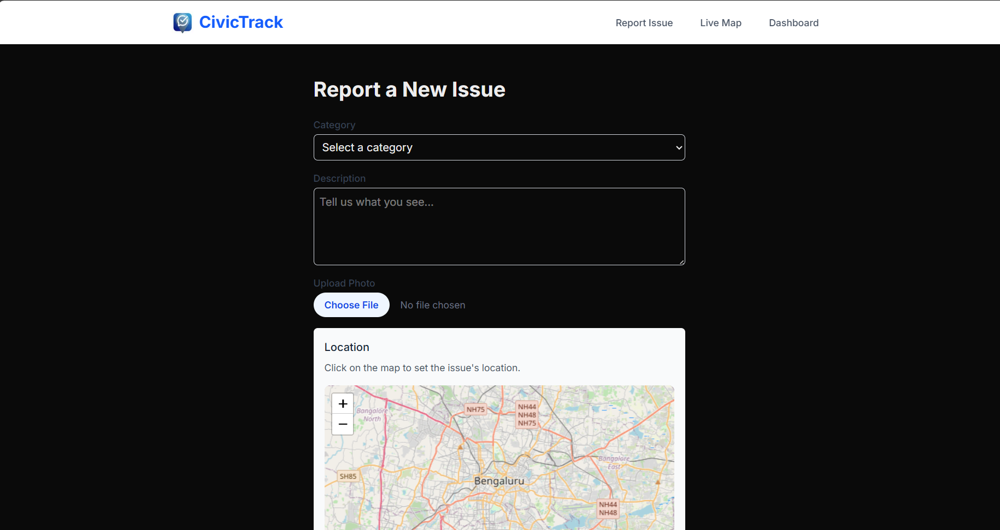
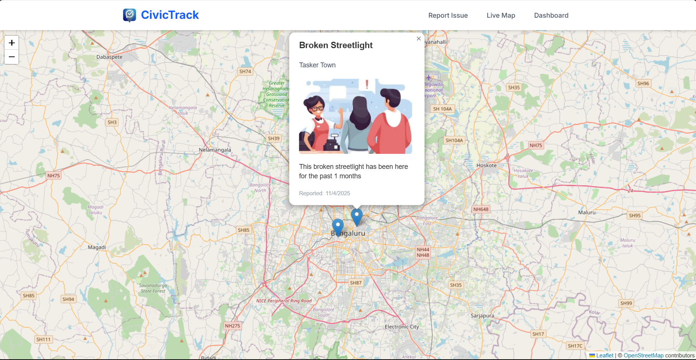
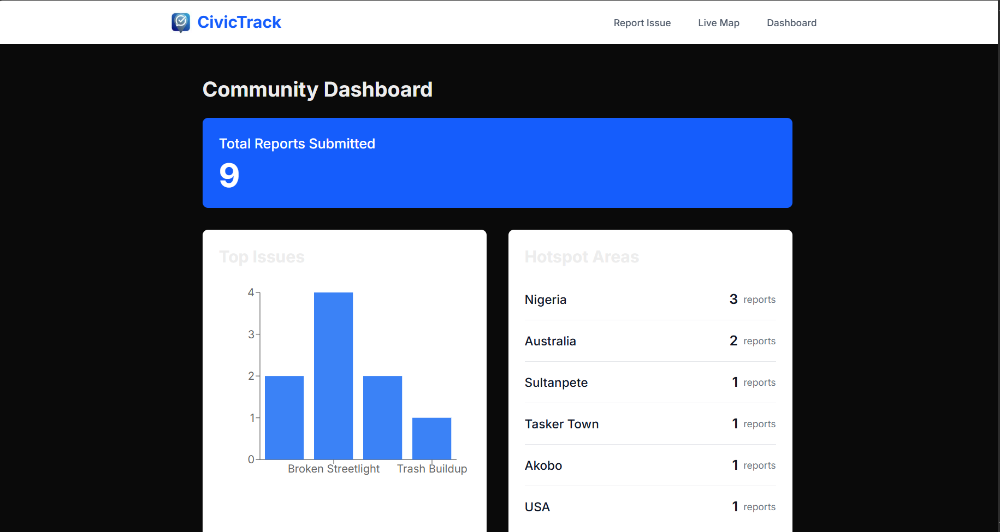

# 🏙️ CivicTrack

CivicTrack is an open-source, public good platform that empowers citizens to report, map, and prioritize local civic issues. It's built to be easily cloned, configured, and deployed by any community or local government.

## 🚀 Live Demo

You can try the live application here: **[https://civictrack-puce.vercel.app/](https://civictrack-puce.vercel.app/)**

## 📸 Screenshots

| Report Form | Live Map | Dashboard |
| :---: | :---: | :---: |
|  |  |  |


---

### The Problem

In many communities, there's a critical information gap between citizens and local government. This gap exists in two ways:

1.  **Reactive:** Citizens have no simple, transparent way to report *existing problems* like potholes or broken streetlights. Their complaints often feel lost.
2.  **Proactive:** Governments have no easy, data-driven way to find out what new social amenities or fixes citizens *actually want* for the future. How do they decide between building a new park, a new clinic, or upgrading roads? They are often forced to guess.

### The Solution

CivicTrack is a flexible, open-source platform that solves both problems at once. It turns a simple form into a powerful tool for data-driven civic prioritization.

1.  **Report & Request (The Configurable Form):**
    A simple, mobile-friendly form. As an **open-source tool**, this form is fully configurable by any local government:
    * **For Complaints:** It can be used to track *existing problems* (e.g., "Pothole," "Trash Buildup").
    * **For Feedback:** A government can set the categories to *proactively poll their citizens* (e.g., "New Community Park," "Better Water Supply," "Road Repair"). Citizens then "vote" by making a submission for the amenity they want.

2.  **Map (The "Where"):**
    A live, interactive map displays all submissions. This shows *where* problems are clustered and, more importantly, *where* the demand for new social amenities is highest.

3.  **Prioritize (The "Hierarchy"):**
    This is the core of the app. The public dashboard automatically analyzes and ranks all submissions. A leader can now see—in one place—that **"Potholes"** are the #1 *complaint* and a **"New Community Park"** is the #1 *request*.

This gives governments a clear, data-driven hierarchy to decide what to fix and what to build next, all based on direct citizen feedback.

---

## How It Works: A Deeper Look

At its heart, CivicTrack is a flexible, data-driven bridge between a community and its leaders. It's designed to be a "plug-and-play" solution for any local government or community group to instantly gather, visualize, and *act on* public feedback.

### The Citizen Experience (The "Input")

* **Step 1: Report an Issue or Request:** The citizen visits the homepage. They see a simple, mobile-friendly form.
* **Step 2: Select a Category:** They choose from a dropdown list. This list is **100% configurable by the admin**.
* **Step 3: Provide Rich Detail:** The user adds a description and uploads a photo directly from their phone.
* **Step 4: "Smart" Location Pinning:** The user clicks on the interactive map (centered on their city) to place a pin. The app then **automatically reverse-geocodes** these coordinates to find the neighborhood name.
* **Step 5: Transparency and Validation:** After submitting, the citizen can visit the **Live Map** page to see their pin on the map along with everyone else's.

### The Admin Experience (The "Actionable Output")

* **Step 1: Easy Configuration:** The admin (a local government's IT team) clones the open-source GitHub repo.
* **Step 2: Personalize the App:** In just 5 minutes, they can:
    * **Set the Map:** Open `components/MapPicker.tsx` and `components/LiveMap.tsx` to change the default coordinates to their city.
    * **Define the Goal:** Open `components/SubmitForm.tsx` and change the `<option>` tags to define their community's needs.
* **Step 3: Deploy for Free:** They deploy the app to Vercel and connect it to a free Supabase backend.
* **Step 4: Get Data-Driven Insights (The Dashboard):** The admin visits the **Dashboard** page to see instant answers.
    * **The "What" (Top Issues):** A bar chart gives them a quantitative hierarchy of the biggest issues.
    * **The "Where" (Hotspot Areas):** A ranked list shows them which neighborhoods are generating the most reports.
* **Step 5: Make an Informed Decision:** The admin can now make an objective, defensible decision based on real-time citizen data.

---

## 🧰 Tech Stack

* **Framework:** Next.js (App Router)
* **Styling:** Tailwind CSS
* **Database:** Supabase (Postgres)
* **File Storage:** Supabase Storage (for photo uploads)
* **Maps:** React Leaflet (Open Source)
* **Charts:** Recharts (Open Source)

---

## 🚀 Getting Started

To run this project for your own community, follow these steps:

### 1\. Clone the Repository

```bash
git clone https://github.com/israelope/CivicTrack.git
cd civictrack
````

### 2\. Install Dependencies

```bash
npm install
```

### 3\. Set Up Supabase

1.  Go to [supabase.com](https://supabase.com/) and create a new free project.
2.  **Database:** Go to the **SQL Editor** and run the query in `setup.sql` (you'll need to create this file) to create your `complaints` table.
3.  **Storage:** Go to the **Storage** section, create a new **public bucket** named `complaint_images`, and add policies to allow `INSERT` and `SELECT` for the `anon` role.

### 4\. Set Up Environment Variables

1.  In your Supabase project, go to **Settings \> API**.

2.  Create a file named `.env.local` in the root of your project.

3.  Copy and paste your keys into the file:

    ```.env
    NEXT_PUBLIC_SUPABASE_URL=YOUR_PROJECT_URL_HERE
    NEXT_PUBLIC_SUPABASE_ANON_KEY=YOUR_ANON_KEY_HERE
    SUPABASE_SERVICE_ROLE_KEY=YOUR_SERVICE_ROLE_KEY_HERE
    ```

### 5\. Run the Development Server

```bash
npm run dev
```

Your app is now running at `http://localhost:3000`.

-----

## ⚙️ Configuration

To make this app your own, there are two key places to customize:

### 1\. Set Your Community's Map Location

You can set the default map center and zoom level for your specific town, state, or country.

  * Open `components/MapPicker.tsx`
  * Open `components/LiveMap.tsx`

In both files, find the `CUSTOMIZE MAP LOCATION` comment block and change the `defaultCenter` and `defaultZoom` variables to match your region.

```javascript
// Example for Bengaluru, India:
const defaultCenter: [number, number] = [12.97, 77.59];
const defaultZoom = 11;
```

### 2\. Customize Complaint Categories

To change the types of issues users can report, edit the `<option>` tags in the submission form.

  * Open `components/SubmitForm.tsx`
  * Find the `<select>` tag with the `id="category"` and add, remove, or edit the `<option>` values.

<!-- end list -->

```html
<select id="category" ...>
  <option value="" disabled>Select a category</option>
  <option value="Pothole">Pothole</option>
  <option value="Trash Buildup">Trash Buildup</option>
  <option value="New Community Park">New Community Park</option>
</select>
```

-----

## 🛣️ Future Roadmap

This MVP is a strong foundation. Future plans to expand the project include:

  * **Admin Dashboard:** A separate, password-protected area for admins to edit categories and map locations directly from the UI, without touching the code.
  * **"Resolved" Status:** Allowing admins to mark issues as "In Progress" or "Resolved," which would then change the pin's color on the live map.
  * **Map Search Bar:** Integrating a geocoding search bar so users can type their address instead of just clicking the map.

-----

## ⚖️ License

This project is open-source and available under the [MIT License](https://www.google.com/search?q=LICENSE).
